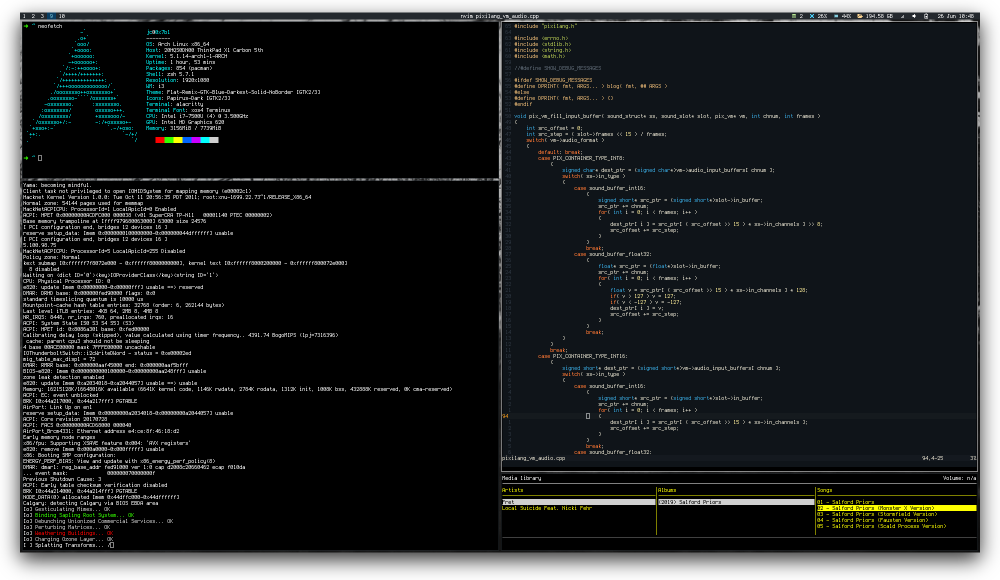

# dotfiles



```
 dunst      > notification daemon
 git        > git config and aliases
 gpg        > gpg-agent config
 i3         > tiling window manager
 mutt       > email client
 nvim       > text editor config
 polybar    > status bar
 ranger     > file manager
 redshift   > screen color temperature
 rofi       > application launcher
 spells     > some automation scripts
 ssh        > ssh-agent service config
 tmux       > terminal multiplexer
 urxvt      > 256 color terminal and some extensions
 xmap       > some keybindings
 zsh        > oh-my-zsh plugins and themes
 ```

# Usage
```
git clone https://github.com/0x7b1/dotfiles.git ~/dotfiles
cd ~/dotfiles
stow * # for a complete configuration
stow git # for a specific configuration
```

> Originaly based on https://github.com/aeolyus/dotfiles
